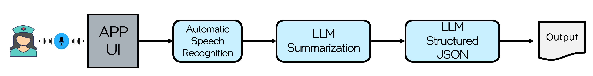

# Medical Transcribe Demo


## Conda environment

### Linux
```
./install-conda.sh
```

### Windows

Follow the instructions from [Conda Windows Install](https://conda-forge.org/download/). For Windows be sure to run each of the commands below in a Conda window.

## GPU Drivers
### Linux
```
./install-gpu.sh
```

### Windows
Managed as part of Windows Updates. If GPU is not shown in TaskMgr then refer to [GPU Drivers](https://www.intel.com/content/www/us/en/download-center/home.html)

## OpenVINO
### Linux
```
./install-openvino.sh
```

### Windows
```
install-openvino.bat
```

## Whisper.cpp (OpenVINO Backend)
### Install
#### Linux
```
./install-whisper.sh
```

Potential error
If you see `E: Unmet dependencies. Try 'apt --fix-broken install' with no packages (or specify a solution).`. Run `sudo apt --fix-broken install`.

#### Windows
- Install [CMake](https://cmake.org/download/)
- Install [Git](https://git-scm.com/downloads)
- Install [MSBuild Tools](https://visualstudio.microsoft.com/downloads/?q=build+tools) under Tools for Visual Studio. After downloading be sure to select Desktop development with C++ (including MSVC and Windows SDK). This is needed if Visual Studio is not installed already.
```
install-whisper.bat
```

### Run Whisper.cpp model serving
#### Linux
```
./run-whisper.sh
```

#### Windows
```
run-whisper.bat
```

## Llama3.2 3B model serving (OVMS)
### Install
1. Gain access to [Llama3.2](https://huggingface.co/meta-llama/Llama-3.2-3B-Instruct) group of models on Hugging Face.
2. Ensure you add the huggingface access token `HUGGINGFACE_TOKEN=<HF_TOKEN>` in `.env`
3. The installation is validated on Ubuntu 24.04 and Windows 11.

#### Linux
```
./install-llama-ovms.sh
```

#### Windows
```
install-llama-ovms.bat
```

### Run Llama3.2 model serving
#### Linux
```
./run-llama-ovms.sh
```

#### Windows
```
run-llama-ovms.bat
```

## Streamlit UI
Can access the demo at `http://localhost:8080`. Feel free to use the audio sample `samples/sample.wav` and upload in the demo, or you can record a simulation of medical checkup QnA. 

### Install
#### Linux
```
./install-streamlit.sh
```

#### Windows
```
install-streamlit.bat
```

### Run Streamlit Demo
#### Linux
```
./run-streamlit.sh
```

#### Windows
```
run-streamlit.bat
```

